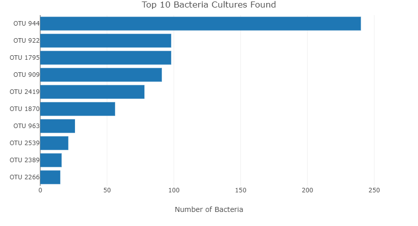
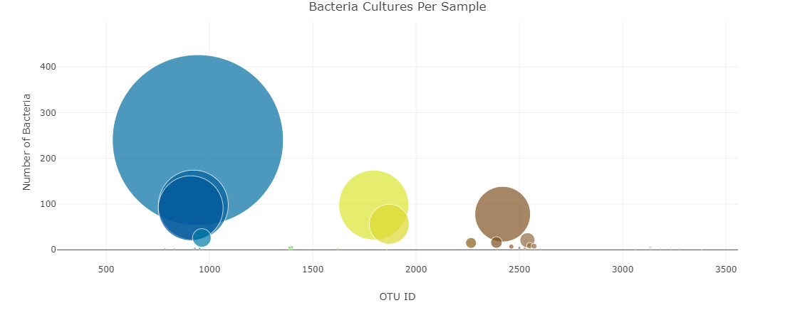

# belly-button-challenge

In this challenge we review microbes found in human navels. 

I have created a dashboard that highlights the top ten microbes found per subject in a bar graph.
> <li> Top Ten Bar Graph for Subject 1280 </li>
> 
There is a second graph, this is a bubble graph with info all bacteria per sample subject. 
> <li> All bacteria for Subject 1280 </li>
> 
This is an interactive dashboard that allows the user to choose their desired test subject.

